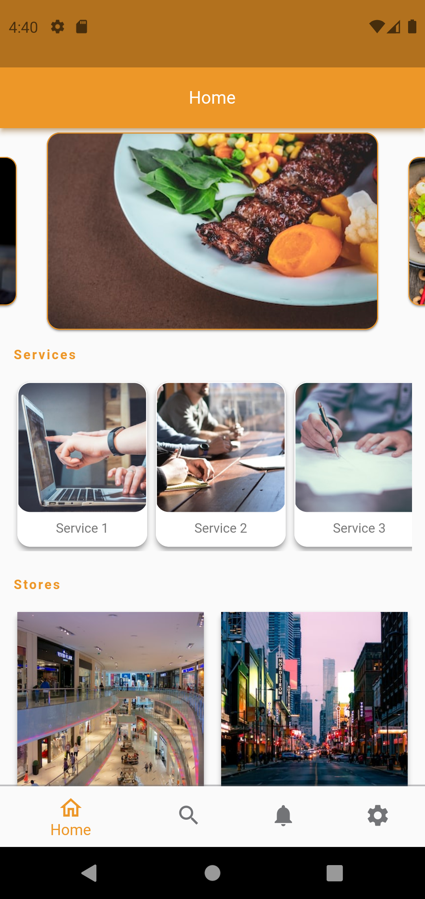
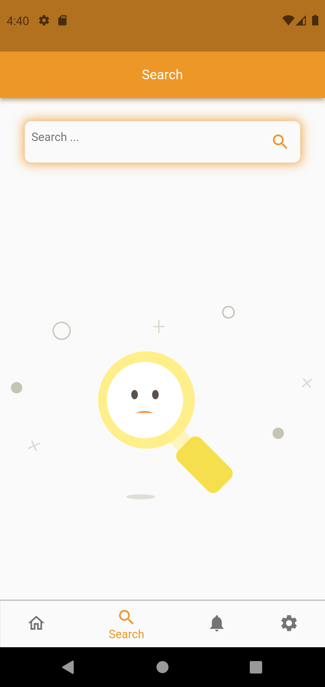
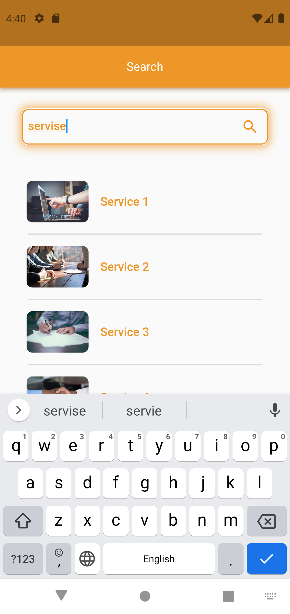
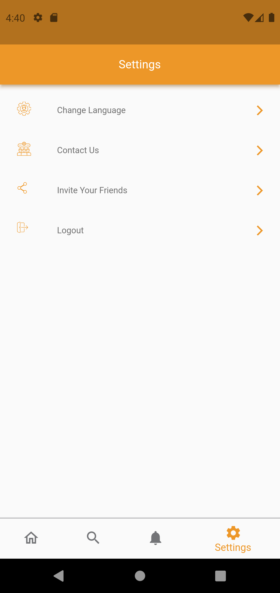
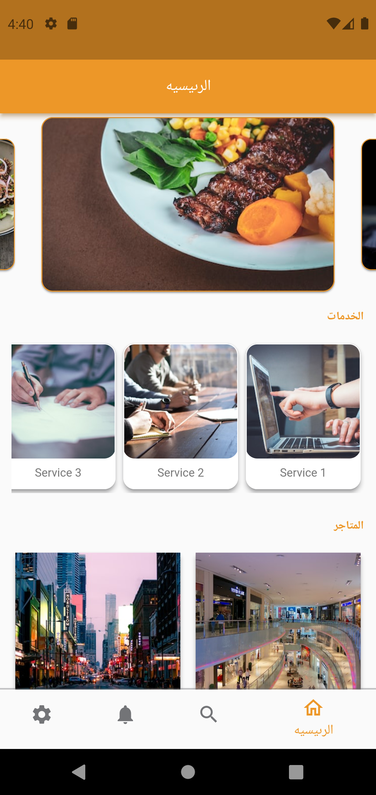
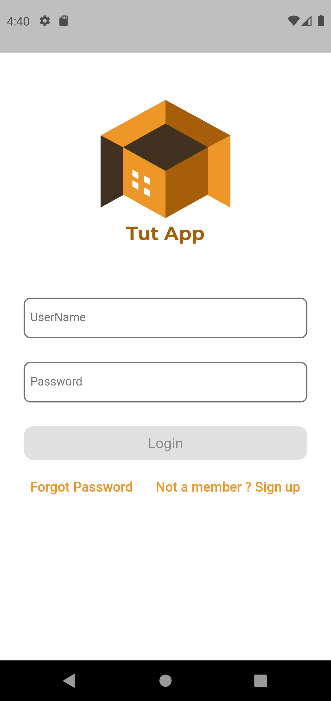
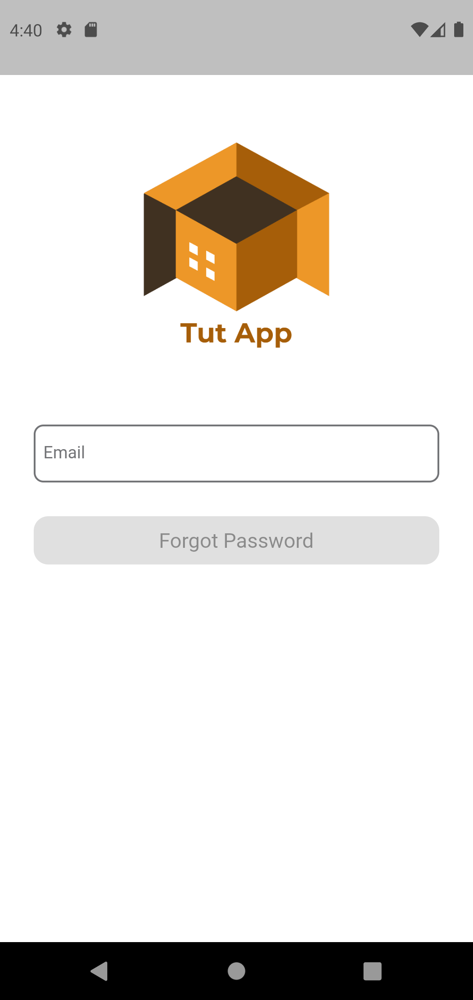
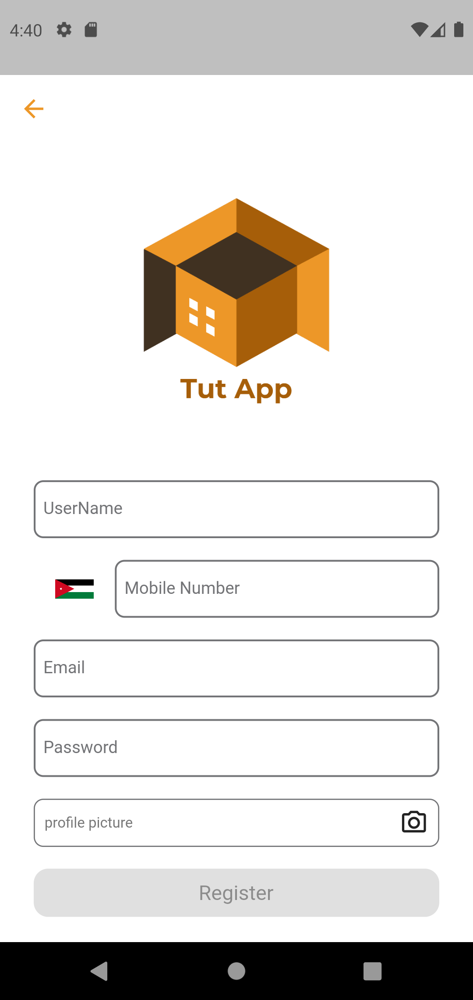

# Flutter Advanced - Clean Architecture With MVVM 


# project outcome
* Clean Architecture Design Pattern
* MVVM - Model - View - View Model Pattern
* ViewModel Inputs and Outputs
* Base ViewModel and Base UseCase
* Application Layer - Dependency Injection, Routes Manager and Application class
* Application Layer - Extensions and Shared Functions
* Data Layer - Data Sources (Remote Data Source/ Local Data Source)
* Data Layer - API Service Client (Same as Retorfit in Android)
* Data Layer - Calling APIs (Remote Data Source)
* Data Layer - Adding Logger Interceptor
* Data Layer - Caching APIs responses (Local Data Source)
* Data Layer - Json Serialization and Annotations
* Data Layer - Repository Implementation
* Data Layer - Mapper (Converting responses into Models)
* Data Layer - Mapper (Using toDomain Concept)
* Data Layer - Applying Null Safety
* Data Layer - Creating Mock APIs (Stub APIs)
* Domain Layer - Models
* Domain Layer - Repository Interfaces
* Domain Layer - UseCases
* Domain Layer - Either Concepts (Left - Failure) / (Right - Success)
* Domain Layer - Data Classes
* Presentation Layer - UI (Splash - Onboarding - Login - Register - Forgot Password - Main - Details - Settings - Notification - Search))
* Presentation Layer - State Renderer (Full Screen States - Popup States)
* Presentation Layer - State Management (Stream Controller - RX Dart - Stream Builder)
* Presentation Layer - Localisations (English - Arabic), (RTL - LTR)
* Presentation Layer - Assets Manager (Android and Ios Icons and Images sizes)
* Presentation Layer - (Fonts - Styles - Themes - Strings - Values - Colors) Managers
* Presentation Layer - Using Json Animations
* Presentation Layer - Using SVG images
* Using 18 Flutter Packages
* Getting Device Info (Android - Ios)
* Using Abstract classes
<br><br>

# Screenshot
   
   
   
   
  


<br><br>
# Project Tree
```
advanced_flutter
.
├── app
│   ├── app_preferences.dart
│   ├── app.dart
│   ├── constants.dart
│   ├── di.dart
│   ├── extensions.dart
│   └── functions.dart
├── data
│   ├── data_sourse
│   │   ├── local_data_source.dart
│   │   └── remotr_data_sourse.dart
│   ├── mapper
│   │   └── mapper.dart
│   ├── network
│   │   ├── app_api.dart
│   │   ├── app_api.g.dart
│   │   ├── dio_factory.dart
│   │   ├── error_handler.dart
│   │   ├── failure.dart
│   │   ├── network_info.dart
│   │   └── requests.dart
│   ├── repository
│   │   └── repository_impl.dart
│   └── response
│       ├── responses.dart
│       └── responses.g.dart
├── domain
│   ├── model
│   │   └── models.dart
│   ├── repository
│   │   └── repository.dart
│   └── usecase
│       ├── base_usecase.dart
│       ├── forgot_usecase.dart
│       ├── home_usecase.dart
│       ├── login_usecase.dart
│       ├── notification_usecase.dart
│       ├── register_usecase.dart
│       ├── search_usecase.dart
│       └── store_details_usecase.dart
├── presentation
│   ├── base
│   │   └── baseviewmodel.dart
│   ├── common
│   │   ├── state_renderer
│   │   │   ├── state_renderer_impl.dart
│   │   │   └── state_renderer.dart
│   │   ├── freezed_data_classes.dart
│   │   └── freezed_data_classes.freezed.dart
│   ├── forgot_password
│   │   ├── view
│   │   │   └── forgot_password_view.dart
│   │   └── viewModel
│   │       └── forgot_password_viewmodel.dart
│   ├── login
│   │   ├── view
│   │   │   └── lodin_view.dart
│   │   └── viewmodel
│   │       └── login_viewmodel.dart
│   ├── main
│   │   ├── pages
│   │   │   ├── home
│   │   │   │   ├── view
│   │   │   │   │   └── home_page.dart
│   │   │   │   └── viewmodel
│   │   │   │       └── home_viewmodel.dart
│   │   │   ├── notification
│   │   │   │   ├── view
│   │   │   │   │   └── notification_page.dart
│   │   │   │   └── viewmodel
│   │   │   │       └── notification_viewmodel.dart
│   │   │   ├── search
│   │   │   │   ├── view
│   │   │   │   │   └── search_page.dart
│   │   │   │   └── viewmodel
│   │   │   │       └── search_viewmolel.dart
│   │   │   └── setting
│   │   │       └── setting_page.dart
│   │   └── main_view.dart
│   ├── on_boarding
│   │   ├── view
│   │   │   └── on_bparding_view.dart
│   │   └── viewmodel
│   │       └── onboarding_viewmodel.dart
│   ├── register
│   │   ├── view
│   │   │   └── register_view.dart
│   │   └── view_model
│   │       └── register_viewmodel.dart
│   ├── resources
│   │   ├── assets_manager.dart
│   │   ├── color_manager.dart
│   │   ├── constants_manager.dart
│   │   ├── font_manager.dart
│   │   ├── langauges_manager.dart
│   │   ├── routes_manager.dart
│   │   ├── string_manager.dart
│   │   ├── styles_manager.dart
│   │   ├── theme_manager.dart
│   │   └── values_manager.dart
│   ├── splash
│   │   └── splash_view.dart
│   └── store_details
│       ├── view
│       │   └── store_details_view.dart
│       └── viewmodel
│           └── store_details_viewmodel.dart
└── main.dart
```